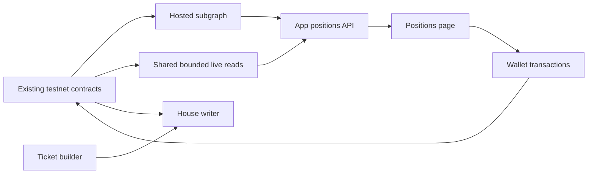

# Independent positions index — implementation plan

Date: 2026-09-17. Revised: 2026-09-18. Ported to `main` and retargeted at the
live v1 deployment 2026-09-19. Status: first release merged to `main`
(`fe02ec0`); local gates green; local rollback/reindex and hosted provider setup
still pending.

Ported from `new-design`, where this was written against the v2 multi-maker
lineage. On `main` there is one house writer and no RFQ relay, so "makers and
the relay" below reads as "the writer service", and v1 `ParlayMinted` carries no
`maker` field. Section 5 retargets accordingly. The v2 bedlam gates (G1, S2b,
S8a evidence) do not apply here and have been removed.

Positions should remain available when the writer service is offline. Index
ticket history once in a hosted subgraph; let the app query it through its own
read API. Keep writer pricing, capital, live exposure, and settlement execution
separate. The chain remains authoritative for ownership and payments.

## Revision: smaller first release

Keep the hosted subgraph, but make its first version event-only. Index mint
terms, ownership, burns, recorded resolution status, and block/transaction
references. Fetch immutable ordered legs through the app API using `parlay(id)`
at a recent canonical block and cache them. This contract retains parlay storage
after burning the NFT, and never changes its legs. Historical `eth_call` at each
mint block is therefore not a prerequisite for independent position discovery.
Historical logs are still required for backfill.

The first release covers sections 1–4 and their rollout checks: an independent,
paginated positions page with accurate ownership and receipt reconciliation.
Section 5 is a subsequent writer-tracking change after read-path parity. Keeping
the existing writer taker index running temporarily does not prevent the new page
from working while the writer is offline. Removing that work is a separate
benefit, not a prerequisite for shipping independent reads.

Alternatives considered:

| Option | Assessment |
| --- | --- |
| Keep reading the writer's `/parlays` taker index | Smallest change, but still depends on the writer being up and its checkpoint being current, and cannot establish completeness from a successful response. |
| Extract a standalone scanner from `Poker` | Reuses TypeScript, but needs independent hosting, persistent storage, reorg handling, and query serving. Prefer only if the hosted pilot fails its requirements. |
| Hosted event-only subgraph + bounded API reads | Recommended first release: moves historical discovery off the writer without requiring mapping-time contract calls. |
| Subgraph also reads immutable legs at mint | Optional later optimization if measured API cache misses justify it and historical calls are proven on the host. |

The user accepted the simpler scope and authorized implementation on September 18,
and the port to `main` on September 19. The three pinned Graph build/test
dependencies were approved and installed; the lockfile regeneration that made
`npm ci` succeed was approved separately on September 19.
Additional dependencies and shared/hosted deployment remain approval boundaries.
No separate database, Redis, analytics service, or contract redeployment is needed.

## Scope and preserved state

- HyperEVM testnet (998) only, with the live v1 manifest
  `registry/deployment.testnet.json`: vault
  `0x407cdc0b15e8d81f4d122481ecf92dbe07dc0169`, start block `61906227`.
  No mainnet work, not even read-only probes.
- No contract redeployment, funding, ABI/event changes, box access, or
  production cutover. No invented sports outcomes to manufacture fixtures.
- Do not deploy, rsync to the Hetzner box, or touch `/opt/hype/writer`. Any
  box-mutating command goes to the user as a single line to run themselves.
- Preserve broadcast artifacts, the writer's `parlays.json` taker index and its
  checkpoints, and unrelated uncommitted web changes. Review file-level diffs
  before implementation.
- Planning authorizes no subscription purchase or external deployment. Repository
  rules require approval before installing new dependencies. Prepare the build,
  tests, provider choice, and exact deployment configuration before any final
  hosted-deployment approval; do not require approval for ordinary local edits.

## Current implementation and why it changes

`web/lib/writer.ts::fetchParlays` already avoids browser history scans. It asks
the writer for ticket IDs, then `web/lib/positions.ts::loadRow` reads each ticket,
owner/burn state, leg settlement, and mint timestamp over RPC.

`writer/src/poker.ts` combines two jobs: a persisted all-ticket taker index and
live exposure/settlement tracking. Its saved historical cursor can delay new-mint
detection after startup, even though `seed()` rebuilt current exposure.

That makes the positions page only as available as the writer. If the writer is
down, restarting, or its checkpoint is behind, the page is empty or incomplete
with no way to tell which. The new path removes writer availability from
positions loading.

## Target data flow and responsibilities

| Component | Responsibility |
| --- | --- |
| Subgraph | Ticket identity, event-emitted terms, wallet associations, current ownership, burns, recorded resolutions, block/transaction references |
| App read API | Validated paginated queries, provider credentials, freshness, cached immutable legs, bounded live-state reads, response caching |
| Frontend | Render pages, retain confirmed receipt information during index lag, verify transactions through the wallet/RPC |
| Writer | Quoting, signing, capital, reservations/exposure, and permissionless Dead/Void poking; no positions dependency after migration |

The project operates both the writer and the app's shared index; the split is
about availability, not ownership. Underlying OutcomeVault settlement recording
remains existing keeper work.

## 1. Confirm provider and isolate the subgraph package

Use Goldsky as the proposed host. Its documentation explicitly lists HyperEVM
testnet subgraphs. Before deploying, verify the actual project supports chain
998, obtain its exact network identifier, and record account-specific rate limits
and billing. Do not infer the testnet identifier from mainnet or guess a slug.

Create `subgraph/` with manifest generation, schema, mappings, ABI inputs, tests,
and a short runbook. Generate deployment address/start block from the existing
manifest and reuse the existing contract ABI artifacts with a drift check.
Record exact Graph build/test dependency versions for approval before installation;
do not add a GraphQL client or another database to the app. Existing `fetch` and
`viem` suffice for the app adapter.

Preflight must prove the host can backfill mint, transfer, and resolution logs
from the deployment block and expose freshness/error metadata. No mapping-time
contract calls are required in the first version. Separately verify the app RPC
can read `parlay(id)` for existing tickets, including burned-ticket fixtures.
Missing legs must produce an explicit partial-data result, not an empty ticket.

Acceptance: reproducible package build; manifest identity matches the live v1
deployment; a concrete
provider/configuration and cost summary ready for review. No live cutover yet.

## 2. Implement ticket and ownership mappings

Use deployment-scoped IDs (`chain + vault + ticket number`) so another vault's
ticket 1 cannot collide. Store monetary integers as integers/decimal strings,
never floating-point USDC.

Minimal entities:

- `Deployment`: chain, vault, start block, schema version.
- `Ticket`: number, original taker, current owner (nullable after burn),
  quote ID, premium, payout, recorded status, burned flag,
  mint timestamp/block/hash, latest resolution references, and burn holder and
  transaction/block references. Keep burn references even when Won was recorded
  in an earlier transaction; its resolution hash is not the later claim hash.
- `WalletTicket`: unique wallet/ticket association with numeric ticket number for
  pagination. Retain associations after transfer or burn for wallet history.

Mappings:

1. `ParlayMinted`: create the ticket entirely from the event and block metadata.
   Initialize status as Open and apply later events in log order.
   The ERC-721 mint `Transfer` is emitted
   before `ParlayMinted`; ignore that zero-address transfer and initialize owner
   from the mint event, rather than requiring a ticket that does not yet exist.
2. `Transfer`: update ownership and both wallets' history associations. On burn,
   retain the `from` holder and receipt references, retain history, and mark no
   current owner. Never create a wallet association for the zero address.
   A burn is not synonymous with a win:
   Void burns too; Dead leaves the token as a receipt.
3. `ParlayResolved`: store the recorded status and resolution transaction. Won
   alone does not mean paid: the subsequent burn distinguishes claimed Won.

The positions list includes currently and previously owned tickets; transferred
out entries are identified as such and cannot offer the old owner a claim action.
Incoming transfers must appear even when the recipient was not the original taker.

Focused tests: mint ordering, exact amounts, incoming/outgoing transfer,
mint+resolve+burn in one transaction, separate Won/claim, Void burn, Dead without
burn, burn-holder attribution, and replay without duplicate history associations.
Exercise a local chain rollback/reindex against the built mapping to confirm the
hosted index follows canonical events rather than leaving phantom ownership.

Acceptance: synthetic lifecycle fixtures pass and the existing real tickets
match receipt/contract data. Do not claim live Won/Void coverage from synthetic tests.

## 3. Add an app-owned read API

Add `web/app/api/positions/route.ts` and a small server-only adapter, separate from
the writer. Use server-only provider URL/credential configuration; never expose
the private RPC or a management key through `NEXT_PUBLIC_*` or logs.

`GET /api/positions?wallet=...&before=...&limit=20` returns:

- Up to 20 wallet-history rows (hard maximum 50), newest ticket number first.
- An exclusive numeric cursor and `hasMore` (fetch one extra association).
- Indexed block/hash, indexing-error state, live observation block/time, and a
  freshness state. GraphQL errors in HTTP 200 are errors, not an empty wallet.

Hydrate ordered legs through `parlay(id)` for the returned page only. Reuse the
existing `viem` client and bounded pool; cache immutable legs by chain/vault/id
with canonical mint block/hash provenance. Reject missing/default parlay data or
terms inconsistent with the indexed mint. Do not permanently cache its mutable
status alongside the immutable legs. Bound cache size; discard entries whose
mint provenance is invalidated. A cache miss adds RPC work, not a history scan.

Validate wallet/cursor/limit; construct fixed GraphQL queries with variables.
Check indexed deployment identity. Pin subsequent pages to the first page's
indexed block for a stable browsing session; restart pagination if that snapshot
is unavailable or invalidated by a reorg. Do not use growing `skip` offsets.

Use `_meta` and a cached current-head sample to detect lag/errors. Initial
testnet freshness budget: 60 seconds; validate it in the pilot. Keep previously
loaded rows visible with an updating/unavailable message instead of showing an
empty wallet when the provider is behind or down. A server restart may lose its
short cache; correctness must not rely on that cache surviving.

`OutcomeVault` has no settlement event, so a ticket-event subgraph alone cannot
reproduce the current per-leg verdicts. Deduplicate the page's leg vault addresses
and read their EVM `settled`/`settleFractionWad` getters through the server with
bounded concurrency and a short cache. Cache results for about 15 seconds, keyed
to the observation block hash in the first release; retain finalized results
longer only after provider finality behavior is verified. Do not read HyperCore
precompiles for this API.
Share in-flight work across concurrent requests on one process. Cache wallet-page
responses briefly (about 10 seconds); no new Redis service in the first version.
Measure repeated reads across multiple instances before adding shared caching.

Markets/labels should load from the app's existing registry/public snapshot, not
require the writer. Audit the full positions-page request graph for hidden
writer dependencies; optional live odds must not block the ticket list.

Acceptance: tests cover pagination, identity mismatch, GraphQL errors, provider
timeout, stale/reorged snapshots, exact ordered leg hydration including burned
tickets, bounded/deduped RPC reads, and correct partial errors.
The writer can be offline while the positions API still works.

## 4. Switch the positions UI and preserve transaction feedback

Adapt `web/lib/positions.ts`, `web/app/(trading)/positions/use-positions.ts`, and
the positions page to consume the new API with pagination. Reuse the existing
row/status derivation and formatting, adding current ownership/history semantics.
Replace per-ticket browser loading with the server response; retain bounded live
RPC reads for actions and receipt reconciliation, not historical discovery.

Audit the reused derivation against the contract: `resolveParlay` can void a
fractional leg with a pending sibling, provided no settled leg is lost. Today's
`deriveRow` waits for all legs before offering that action. Add this mixed-state
case to the UI checks rather than preserving the mismatch during migration.

Update summary semantics with pagination and transfers. Label summaries as
covering loaded tickets; do not present one page as whole-wallet totals. Attribute
premium staked to the original taker and claimed/refunded amounts to the burn
holder, not every wallet associated with a ticket. Current claimable amounts and
actions belong to its current owner. A former owner's history must not imply
they received a later holder's payout. Whole-wallet aggregates are deferred.

Before claim/resolve, refresh relevant contract state and simulate the intended
transaction. A stale indexed owner/status must not be the sole basis for an
enabled action. The contract remains the final authorization check.

`web/lib/ticket.ts::mintTicket` currently returns only a boolean. Return validated
receipt details/ticket ID to `build/use-ticket.ts` so a confirmed mint appears
immediately without waiting for indexing. Keep a small receipt-backed overlay
scoped by chain/vault/wallet across local navigation/reload, discard invalid or
reorged receipts, and reconcile by ticket ID once the index reaches the receipt.
Apply the same principle after claim/refund so a stale indexed row cannot undo
confirmed transaction feedback. A timeout waiting for indexing must not suggest
minting again. No unbounded polling or full-history fallback.

Acceptance: mocked delayed-index mint/claim/refund, transferred ownership,
wallet switching, pagination and provider-outage checks pass. Browser verification
shows the existing tickets with correct ownership, no positions calls to the
writer, and no browser `eth_getLogs` history scan.

## 5. Follow-up: separate writer live tracking from positions history

Only after subgraph/API parity is established, add an explicit compatibility
mode to stop maintaining the writer's all-ticket taker index (`writer/parlays.json`,
served as `GET /parlays`). Retain today's legacy mode during rollback; the new
mode ignores historical index checkpoints without editing or deleting their files.

Preserve `Poker.seed()` rebuilding current exposure before quoting, then scan
live events from its seed head forward. Preserve reservation conversion,
mint/resolve idempotency, partial-chunk progress, rate pacing, and the Dead and
Void pokes. Never disable the poker or substitute delayed subgraph data for live
exposure. This separation does not fix every restart cost: today's `seed()` still
reads IDs 1 through `nextId` to rebuild open exposure. Measure that independently;
do not promise constant-time writer startup from the subgraph migration.
Test a mint between the seed snapshot and first scan, and a restart with an old
legacy index, proving neither skips exposure nor restarts historical backfill.

Until this mode is verified, leave the live writer on its proven configuration.
Quote journals, keys, state files, and deployment verification stay intact.

Keep legacy `/parlays` only for the explicit rollback window. `/limits` remains
quote-related and separate from positions. Remove unused legacy plumbing only
after migration sign-off.

Acceptance: writer tests prove cold-start exposure and mint/resolve tracking with
no dependency on a positions provider or old index file.

## 6. Testnet rollout, operating checks, and rollback

Execute in order:

1. Complete the local package/tests and review exact provider deployment config.
   Obtain required dependency/provider approval at the applicable boundary.
2. Deploy the approved testnet-only subgraph and let it reach the current chain.
   Run parity checks for the existing tickets: terms, legs, owners, timestamp,
   status, burn state and transaction references. Use a block-pinned comparison.
3. Enable the new API/UI locally behind one rollback switch; keep the old path
   as an explicit operator-selected mode, never an invisible outage fallback.
4. Verify positions with the writer stopped, as a bounded user-driven laptop
   test. Restore it promptly for real settlement and poking; do not run outage
   tests during a settlement observation window.
5. Exercise receipt/index-lag behavior with fixtures first. Reuse existing mint
   receipts; another live testnet mint is optional, only when needed to prove the
   integrated UI flow. Never repeat deployment/funding to test indexing.
6. Record actual API latency, RPC reads per page/cache miss, indexing delay/errors,
   storage and provider usage after the pilot. Compare with the existing path;
   this plan does not yet establish a measured latency or cost improvement.
7. Record first-release outcomes and rollback instructions in
   [the runbook](../../../subgraph/README.md). Production/box rollout remains a
   separately authorized task.
8. In the follow-up, enable independent writer tracking, restart the writer, and
   verify exposure recovery/live updates. Recheck positions independence.

Rollback: switch the app to the existing writer-backed positions path
(`NEXT_PUBLIC_POSITIONS_SOURCE=legacy`, then rebuild) and restore legacy writer
indexing mode if it had been disabled. Preserved legacy checkpoints may need
catch-up; do not promise an instant complete index or edit cursors to pretend
they are current. No contract/data migration is needed, and no writer state file
or hosted index should be deleted as part of rollback.

Required implementation gates: subgraph codegen/build + focused mapping tests;
`npm run check --prefix writer`; `npm run check --prefix web`; repository
`scripts/verify.sh` before final integration if applicable. Add no Solidity changes
for this feature. Record command output and distinguish local fixture results,
HTTP checks, browser checks, and live on-chain evidence.

First-release acceptance means positions remain usable without the writer,
pagination and ownership history are correct, summaries do not misattribute
payments, confirmed transactions survive indexing lag in the UI, rollback is
exercised, and measured provider use fits the selected plan. The writer follow-up
additionally removes historical event catch-up from live tracking; its existing
seed scan remains.

## Provider facts and sources (rechecked September 18, 2026)

- [Goldsky HyperEVM support](https://docs.goldsky.com/chains/hyperevm): testnet
  support is documented; actual network identifier and project access still need
  setup verification.
- [Goldsky billing](https://docs.goldsky.com/pricing/summary): Starter has a
  one-time $100 credit; Scale has monthly free allowances, including 2250 subgraph
  worker-hours and 100k stored entities. Paid compute is $0.05/worker-hour.
  Starter does not receive the Scale allowances and pauses when credits run out.
  Confirm current dashboard terms before deployment; one ticket can create
  multiple entities/history associations, so entities do not equal users.
- [Goldsky pricing](https://goldsky.com/pricing): no per-query fee within rate
  limits. Query throughput and compute/storage budgets are separate checks.
  Its comparison table still labels allowances under Starter, conflicting with
  the billing documentation and its own credit FAQ; verify dashboard terms
  before quoting an ongoing cost or relying on an allowance.
- [GraphQL API](https://thegraph.com/docs/en/subgraphs/querying/graphql-api/):
  filtering, cursor-style pagination, block-pinned reads, and `_meta` query
  metadata are the basis for the adapter. Verify host behavior in the pilot.

The local implementation lives in `subgraph/` and the web positions API/UI;
see [the runbook](../../../subgraph/README.md) for configuration and outstanding
verification gates. Provider accounts, new dependency installation, hosted
deployments, paid plans and production configuration have not been changed.

## v1 port record (September 19, 2026)

Merged to `main` as `fe02ec0`, retargeted from the v2 vault to
`registry/deployment.testnet.json`. Deltas against the plan as written:

- v1 `ParlayMinted` has no `maker` argument, so `Ticket.maker` was dropped from
  the schema and mapping, and the API's `parlay.writer == ticket.maker`
  cross-check with it. `Row.parlay.writer` now comes from the `parlay(id)` read
  §3 already makes, so the check on premium/payout consistency is unchanged.
- `generate.mjs` reads the v1 registry file; identity, manifest and event ABIs
  are generated from it and `generate.mjs --check` is wired into
  `scripts/verify.sh`.
- §4's `deriveRow` correction shipped with the port: a fractional leg with a
  pending sibling now offers "Reclaim premium", matching `resolveParlay`. The
  writer side of the same asymmetry shipped as `daf0eeb`, which pokes Void as
  well as Dead parlays.
- §5 is not started. The writer still serves `GET /parlays` and the app still
  defaults to it; the new path is opt-in behind
  `NEXT_PUBLIC_POSITIONS_SOURCE=subgraph`.

Gates run locally: `bash scripts/verify.sh` green (Solidity 172, keeper 26,
writer 123, subgraph 4, web 46, tooling 16, plus the Next production build),
`node web/scripts/check-positions-http.mjs` green, Matchstick 4/4 against the v1
vault and event signature. Nothing was deployed; no hosted subgraph exists.

## Writer deploy record (September 19, 2026)

`daf0eeb` is live on the box. `main` pushed to `hyperflip/main` at `b6f4d8a`;
deploy was `rsync -av writer/src/ root@91.99.94.25:/opt/hype/writer/src/` plus
`systemctl restart writer`, the keeper deliberately left running. The commit
changes only `writer/src`, so the `DEPLOY.md` tarball and `npm ci` were not
needed.

Pre-deploy state: 10 open parlays (`nextId` 28), of which 0 classified Void and
0 Dead — every settled leg was a hit, the rest unsettled. So the first tick was
expected to broadcast nothing, and `/limits` bankroll `1012972339` / reserved `0`
and the six non-zero per-market exposures are unchanged after the restart. That
is the designed no-op, not a failed deploy.

Verified on the box instead: `grep -c parlayIsVoid writer/src/poker.ts` = 2 and
`poking-void-parlay` = 1, synced mtimes 15:46 UTC against
`ActiveEnterTimestamp=16:33:13 UTC`, `systemctl is-active keeper writer caddy`
all active, `/health` `seeded: true`, `openParlays` 10, no `poke-failed`, and
`WRITER_URL=https://writer.hyperflip.xyz node tools/smoke.mjs` reporting
`live 129/129, priced 22, open 10`.

Still unexercised in production: no Void ticket has existed since the deploy, so
the poke path has only unit coverage. The first one appears as a
`poking-void-parlay` line in `journalctl -u writer`; a `poke-failed` carrying
`NOT_OPEN` beside it means the taker reclaimed first, which is intended.
