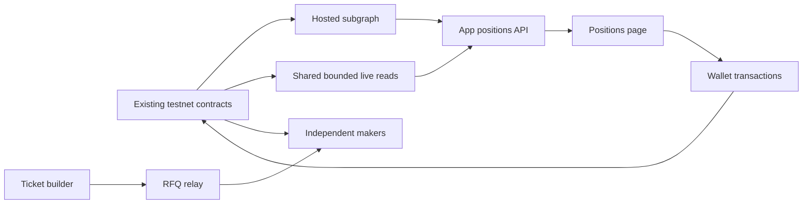

# Independent positions index — implementation plan

Date: 2026-09-17. Status: proposed; implementation and provider setup not started.

Positions should remain available when every maker and the RFQ relay is offline.
Index ticket history once in a hosted subgraph; let the app query it through its
own read API. Keep maker pricing, capital, live exposure, and settlement execution
separate. The chain remains authoritative for ownership and payments.

## Scope and preserved state

- Start on HyperEVM testnet (998), with the existing v2 manifest
  `registry/deployment.testnet-v2.json`: vault
  `0x075b4c6a7ce42890d839f774abfe8206f3c18a76`, start block `64446629`.
- No contract redeployment, funding, ABI/event changes, box access, v1 change,
  or production cutover. No invented sports outcomes to manufacture fixtures.
- Preserve `.env.s8a*`, `~/.local/state/hype-s8a`, broadcast artifacts, and
  unrelated uncommitted web changes. Review file-level diffs before implementation.
- This plan does not pass G1 or replace S2b observations. S8a evidence currently
  proves A's four mints, B's ticket 5, B-only failover, and B restart recovery.
  A restoration and post-mint relay recovery still need checks. Keep the real
  Dead-settlement receipt and Core credit/timing/pruning work on their own track.
- Planning authorizes no subscription purchase or external deployment. Repository
  rules require approval before installing new dependencies. Prepare the build,
  tests, provider choice, and exact deployment configuration before any final
  hosted-deployment approval; do not require approval for ordinary local edits.

## Current implementation and why it changes

`web/lib/writer.ts::fetchParlays` already avoids browser history scans. It asks
the relay for ticket IDs, then `web/lib/positions.ts::loadRow` reads each ticket,
owner/burn state, leg settlement, and mint timestamp over RPC.

`writer/src/poker.ts` combines two jobs: a persisted all-maker taker index and
live maker-specific exposure/settlement tracking. Its saved historical cursor
can delay new-mint detection after startup, even though `seed()` rebuilt current
exposure. Every maker also repeats the positions scan.

The relay now falls back between maker indexes, but still prefers configured
order. A reachable maker with an older index can omit a recent ticket. The new
path removes maker availability and index selection from positions loading.

## Target data flow and responsibilities

| Component | Responsibility |
| --- | --- |
| Subgraph | Ticket identity, immutable terms/legs, ownership history, burns, recorded resolutions, block/transaction references |
| App read API | Validated paginated queries, provider credentials, freshness, small live-state overlay, response caching |
| Frontend | Render pages, retain confirmed receipt information during index lag, verify transactions through the wallet/RPC |
| Relay | RFQ fan-out, signature validation, best quote selection; no positions dependency after migration |
| Each maker | Its own RPC, funds, pricing, reservations/exposure, and permissionless losing-ticket resolution |

The project operates the app's shared index. External makers operate their own
risk systems; our A/B processes are the reference implementation and test makers.
If we retain a house maker, we operate risk controls only for that capital.
Underlying OutcomeVault settlement recording remains existing keeper work.

## 1. Confirm provider and isolate the subgraph package

Use Goldsky as the proposed host. Its documentation explicitly lists HyperEVM
testnet subgraphs. Before deploying, verify the actual project supports chain
998, obtain its exact network identifier, and record account-specific rate limits
and billing. Do not infer the testnet identifier from mainnet or guess a slug.

Create `subgraph/` with manifest generation, schema, mappings, ABI inputs, tests,
and a short runbook. Generate deployment address/start block from the existing
manifest and reuse the existing contract ABI artifacts with a drift check.
Record exact Graph build/test dependency versions for approval before installation;
do not add a GraphQL client or another database to the app. Existing `fetch` and
`viem` suffice for the app adapter.

Preflight must prove the host can backfill the existing mint blocks and perform
`parlay(id)` at the event block. This historical read is essential because
`ParlayMinted` does not contain legs. Do not silently publish incomplete tickets
when a mapping read fails. If historical calls are unsupported, stop this provider
path and revisit transaction-input decoding or a separate indexer explicitly.

Acceptance: reproducible package build; manifest identity matches v2; a concrete
provider/configuration and cost summary ready for review. No live cutover yet.

## 2. Implement ticket and ownership mappings

Use deployment-scoped IDs (`chain + vault + ticket number`) so another vault's
ticket 1 cannot collide. Store monetary integers as integers/decimal strings,
never floating-point USDC.

Minimal entities:

- `Deployment`: chain, vault, start block, schema version.
- `Ticket`: number, original taker, current owner (nullable after burn), maker,
  quote ID, premium, payout, ordered legs, recorded status, burned flag,
  mint timestamp/block/hash and latest resolution references.
- `WalletTicket`: unique wallet/ticket association with numeric ticket number for
  pagination. Retain associations after transfer or burn for wallet history.

Mappings:

1. `ParlayMinted`: create the ticket from the event and read only its immutable
   legs from `parlay(id)` at that block. Initialize status from event chronology,
   not the getter's end-of-block status. The ERC-721 mint `Transfer` is emitted
   before `ParlayMinted`; ignore that zero-address transfer and initialize owner
   from the mint event, rather than requiring a ticket that does not yet exist.
2. `Transfer`: update ownership and both wallets' history associations. On burn,
   retain history and mark no current owner. A burn is not synonymous with a win:
   Void burns too; Dead leaves the token as a receipt.
3. `ParlayResolved`: store the recorded status and resolution transaction. Won
   alone does not mean paid: the subsequent burn distinguishes claimed Won.

The positions list includes currently and previously owned tickets; transferred
out entries are identified as such and cannot offer the old owner a claim action.
Incoming transfers must appear even when the recipient was not the original taker.

Focused tests: mint ordering, exact legs/amounts/maker, incoming/outgoing transfer,
mint+resolve+burn in one transaction, separate Won/claim, Void burn, Dead without
burn, failed historical read, and replay without duplicate history associations.
Exercise a local chain rollback/reindex against the built mapping to confirm the
hosted index follows canonical events rather than leaving phantom ownership.

Acceptance: synthetic lifecycle fixtures pass and the existing five real tickets
match receipt/contract data. Do not claim live Won/Void coverage from synthetic tests.

## 3. Add an app-owned read API

Add `web/app/api/positions/route.ts` and a small server-only adapter, separate from
the RFQ relay. Use server-only provider URL/credential configuration; never expose
the private RPC or a management key through `NEXT_PUBLIC_*` or logs.

`GET /api/positions?wallet=...&before=...&limit=20` returns:

- Up to 20 wallet-history rows (hard maximum 50), newest ticket number first.
- An exclusive numeric cursor and `hasMore` (fetch one extra association).
- Indexed block/hash, indexing-error state, live observation block/time, and a
  freshness state. GraphQL errors in HTTP 200 are errors, not an empty wallet.

Validate wallet/cursor/limit; construct fixed GraphQL queries with variables.
Check indexed deployment identity. Pin subsequent pages to the first page's
indexed block for a stable browsing session; restart pagination if that snapshot
is unavailable or invalidated by a reorg. Do not use growing `skip` offsets.

Use `_meta` and a cached current-head sample to detect lag/errors. Initial
testnet freshness budget: 60 seconds; validate it in the pilot. Keep previously
loaded rows visible with an updating/unavailable message instead of showing an
empty wallet when the provider is behind or down. A server restart may lose its
short cache; correctness must not rely on that cache surviving.

`OutcomeVault` has no settlement event, so a ticket-event subgraph alone cannot
reproduce the current per-leg verdicts. Deduplicate the page's leg vault addresses
and read their EVM `settled`/`settleFractionWad` getters through the server with
bounded concurrency and a short cache. Retain finalized results; cache pending
results for about 15 seconds. Do not read HyperCore precompiles for this API.
Share in-flight work across concurrent requests on one process. Cache wallet-page
responses briefly (about 10 seconds); no new Redis service in the first version.
Measure repeated reads across multiple instances before adding shared caching.

Markets/labels should load from the app's existing registry/public snapshot, not
require the RFQ relay. Audit the full positions-page request graph for hidden
maker/relay dependencies; optional live odds must not block the ticket list.

Acceptance: tests cover pagination, identity mismatch, GraphQL errors, provider
timeout, stale/reorged snapshots, deduped leg reads, and correct partial errors.
Both makers and the relay can be offline while the positions API still works.

## 4. Switch the positions UI and preserve transaction feedback

Adapt `web/lib/positions.ts`, `web/app/(trading)/positions/use-positions.ts`, and
the positions page to consume the new API with pagination. Reuse the existing
row/status derivation and formatting, adding current ownership/history semantics.
Replace per-ticket browser loading with the server response; retain bounded live
RPC reads for actions and receipt reconciliation, not historical discovery.

Before claim/resolve, refresh relevant contract state and simulate the intended
transaction. A stale indexed owner/status must not be the sole basis for an
enabled action. The contract remains the final authorization check.

`web/lib/ticket.ts::mintTicket` currently returns only a boolean. Return validated
receipt details/ticket ID to `build/use-ticket.ts` so a confirmed mint appears
immediately without waiting for indexing. Keep a small receipt-backed overlay
scoped by chain/vault/wallet across local navigation/reload, discard invalid or
reorged receipts, and reconcile by ticket ID once the index reaches the receipt.
Apply the same principle after claim/refund so a stale indexed row cannot undo
confirmed transaction feedback. A timeout waiting for indexing must not suggest
minting again. No unbounded polling or full-history fallback.

Acceptance: mocked delayed-index mint/claim/refund, transferred ownership,
wallet switching, pagination and provider-outage checks pass. Browser verification
shows all five S8a tickets, correct A/B ownership, and no positions calls to maker
or relay endpoints and no browser `eth_getLogs` history scan.

## 5. Separate maker live tracking from positions history

Only after subgraph/API parity is established, add an explicit compatibility
mode to stop maintaining the maker's all-ticket positions index. Retain today's
legacy mode during rollback; the new mode ignores historical index checkpoints
without editing or deleting their files.

Preserve `Poker.seed()` rebuilding current own-maker exposure before quoting,
then scan live events from its seed head forward. Preserve reservation conversion,
mint/resolve idempotency, partial-chunk progress, rate pacing and Dead pokes.
Never disable the poker or substitute delayed subgraph data for live exposure.
Test a mint between the seed snapshot and first scan, and a restart with an old
legacy index, proving neither skips exposure nor restarts historical backfill.

Until this mode is verified, leave funded S8a makers on the proven configuration.
For this deployment, recovery must show A tracking tickets 1–4 and B tracking 5.
Quote journals, keys, state files, and deployment verification stay intact.

Remove positions proxying from the normal relay path after the app switches;
keep legacy `/parlays` only for the explicit rollback window. `/limits` remains
quote-related and separate from positions; aggregate maker pricing/cap policies
is a different task. Remove unused legacy plumbing only after migration sign-off.

Acceptance: writer tests prove cold-start exposure, mint/resolve tracking and
maker isolation with no dependency on a positions provider or old index file.

## 6. Testnet rollout, operating checks, and rollback

Execute in order:

1. Complete the local package/tests and review exact provider deployment config.
   Obtain required dependency/provider approval at the applicable boundary.
2. Deploy the approved testnet-only subgraph and let it reach the current chain.
   Run parity checks for tickets 1–5: terms, legs, owners, maker, timestamp,
   status, burn state and transaction references. Use a block-pinned comparison.
3. Enable the new API/UI locally behind one rollback switch; keep the old path
   as an explicit operator-selected mode, never an invisible outage fallback.
4. Verify positions with A stopped, B stopped, then relay stopped as bounded
   user-driven laptop tests. Restore the services promptly for real settlement;
   do not perform outage tests during the planned S2b/G1 observation window.
5. Exercise receipt/index-lag behavior with fixtures first. Reuse existing mint
   receipts; another live testnet mint is optional, only when needed to prove the
   integrated UI flow. Never repeat deployment/funding to test indexing.
6. Enable independent maker tracking, restart A/B separately, and verify exposure
   recovery/live updates. Recheck positions remain independent. Record actual
   requests, indexing delay/errors, storage and provider usage after the pilot.
7. Update S8a evidence/handoff with outcomes and rollback instructions. Keep G1
   pending until its real settlement receipt proves payment to the stored maker.
   Production/box rollout remains a separately authorized task.

Rollback: switch the app to the existing maker-backed positions path and restore
legacy maker indexing mode if it had been disabled. Preserved legacy checkpoints
may need catch-up; do not promise an instant complete index or edit cursors to
pretend they are current. No contract/data migration is needed, and no saved
S8a state or hosted index should be deleted as part of rollback.

Required implementation gates: subgraph codegen/build + focused mapping tests;
`npm run check --prefix writer`; `npm run check --prefix web`; repository
`scripts/verify.sh` before final integration if applicable. Add no Solidity changes
for this feature. Record command output and distinguish local fixture results,
HTTP checks, browser checks, and live on-chain evidence.

Done means positions remain usable without makers/relay, pagination and ownership
history are correct, confirmed transactions survive indexing lag in the UI,
maker restarts no longer wait on positions history, rollback is exercised, and
measured provider use fits the selected plan. G1/S2b remain independent gates.

## Provider facts and sources (checked September 17, 2026)

- [Goldsky HyperEVM support](https://docs.goldsky.com/chains/hyperevm): testnet
  support is documented; actual network identifier and project access still need
  setup verification.
- [Goldsky billing](https://docs.goldsky.com/pricing/summary): Starter has a
  one-time $100 credit; Scale has monthly free allowances, including 2250 subgraph
  worker-hours and 100k stored entities. Paid compute is $0.05/worker-hour.
  Confirm current dashboard terms before deployment; one ticket can create
  multiple entities/history associations, so entities do not equal users.
- [Goldsky pricing](https://goldsky.com/pricing): no per-query fee within rate
  limits. Query throughput and compute/storage budgets are separate checks.
- [GraphQL API](https://thegraph.com/docs/en/subgraphs/querying/graphql-api/):
  filtering, cursor-style pagination, block-pinned reads, and `_meta` query
  metadata are the basis for the adapter. Verify host behavior in the pilot.

Provider accounts, tooling installation, hosted deployments, paid plans and
production configuration have not been changed by preparing this plan.
